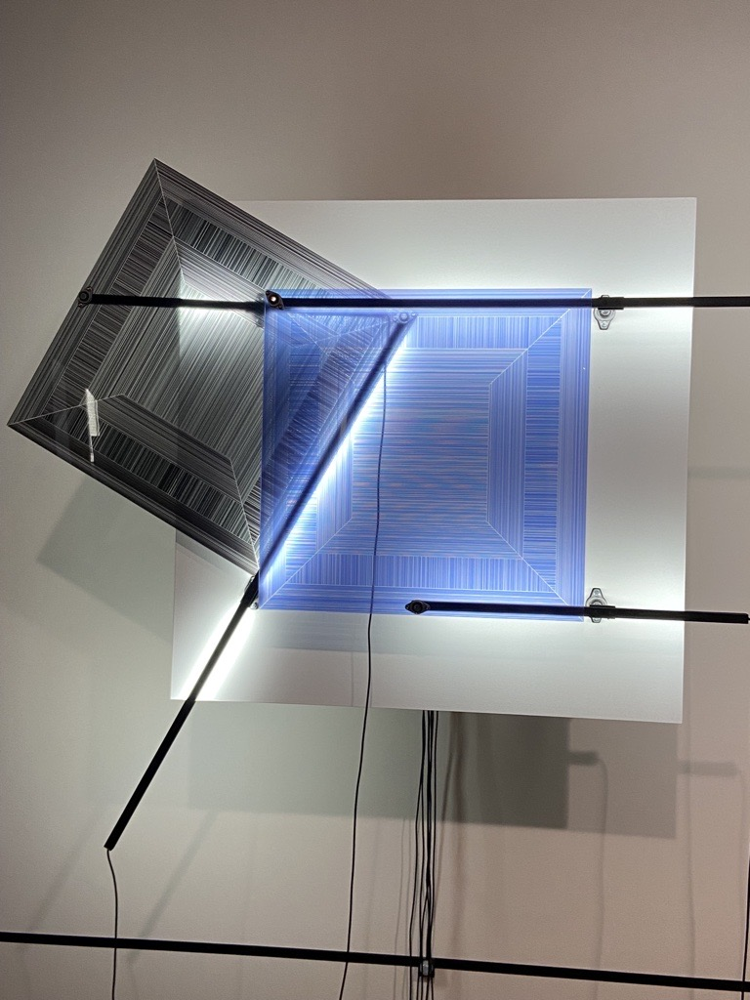
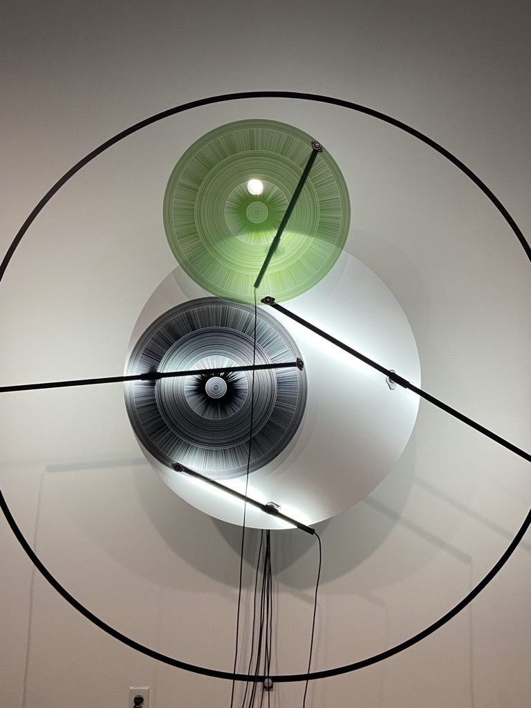
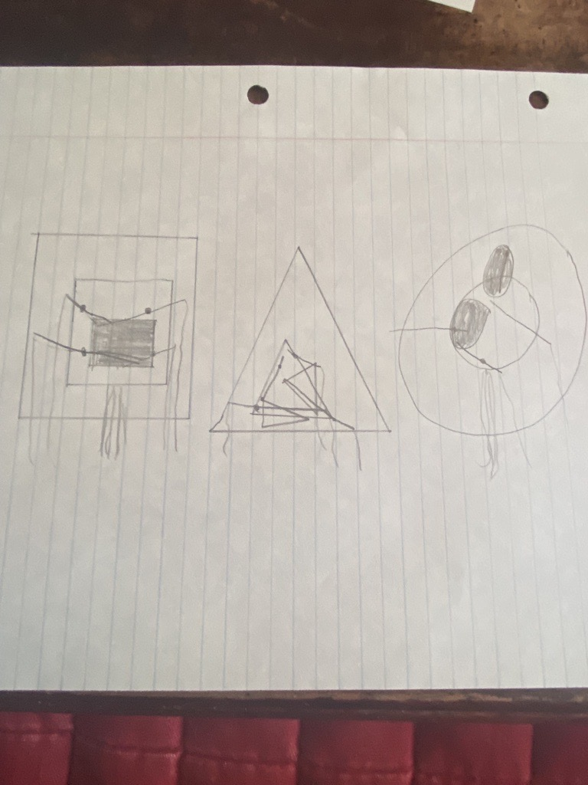

# Mécansimes de dessaisissement (rond, carré, triangle)

</img> </img> </img> 

### Firme:
Maison des arts de Laval.

### Créé en 2021. Le projet a duré de 2019 à 2021.

### Exposition:
Béchard Hudon

### Lieu d'exposition:
Maison des arts de Laval, dans la salle Alfred Pellan.

### Date de visite:
Jeudi 17 mars 2021.

### Description de l'oeuvre:

</img> 

S'activant via des détecteurs de mouvement, les sculptures murales qui composent la série Mécanismes de dessaisissement tendent à capter le regard, l'emportant dans une choréographie à la fois géométrique, lumineuse et chromatique. Dessinées une à une au moyen d'un logiciel, les fines rayures qui caractérisent les surfaces en action génèrent des champs de profondeur mouvants qui complexifient l'expérience visuelle dans le temps. Par ailleurs, les dispositifs électromécaniques qui alimentent ces structures sont laissés visibles de façon à déjouer la pureté formelle de l'ensemble, entre autres à travers les lignes plus aléatoires que dessinent les fils électriques.

###### Texte pris du cartel.

### Mise en espace:
Premièrement, il faut prendre un mur pour accrocher l'oeuvre. Le mur doit être blanc et la salle où se trouve l'oeuvre doit être spacieuse pour que le monde puisse l'observer avec ais. Deuxièmement, il faut brancher tous les fils pour que l'oeuvre marche. Et ensuite il faut activer l'oeuvre. Il faut aussi avoir de l'éclairage comme une lumière installé dans l'oeuvre.

### Composantes techniques:

</img> 

Des capteurs, les formes colorées, les formes blanches et des bâtons métalliques où vont les fils.

### Mise en exposition:
La seule chose nécessaire pour faire la mise en exposition sont des barres métalliques de soutien pour coller les oeuvres au mur.

### Expérience vécue:
Mon expérience avec cette oeuvre était intéressante. Son interactivité est plutôt basique, il faut simplement se placer devant l'oeuvre et elle commence à bouger dans des sens différents. Le concept de cet oeuvre est unne bonne idée mais je pense que cela requiert trop de temps car il faut que la personne regarde l'oeuvre pendant un long moment pour voir si l'oeuvre bouge. J'ai compris ce qu'elle faisait après avoir revenu à l'oeuvre car je voyais enfin qu'elle avait fait bouger les formes. Je pense que si le mouvement était plus rapide et plus apparent, j'aurais probablement plus aprrécié cette oeuvre.

</img> 

