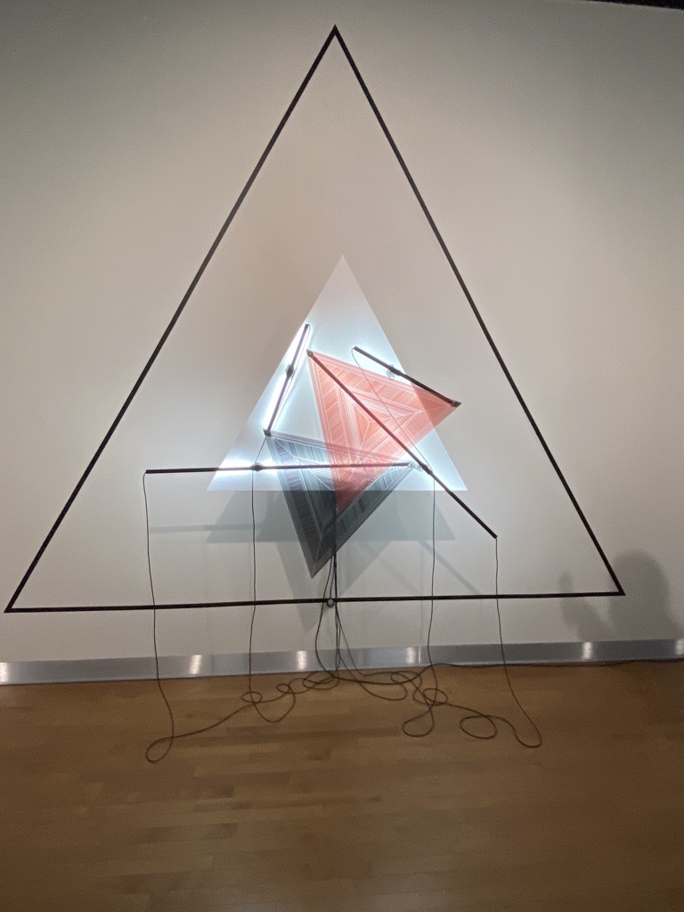

# Mécansimes de dessaisissement (rond, carré, triangle)

</img> </img> </img> 

### Firme:
Maison des arts de Laval.

### Créé en 2021. Le projet a duré de 2019 à 2021.

### Exposition:
Béchard Hudon

### Lieu d'exposition:
Maison des arts de Laval, dans la salle Alfred Pellan.

### Date de visite:
Jeudi 17 mars 2021.

Description de l'oeuvre:

</img> 

