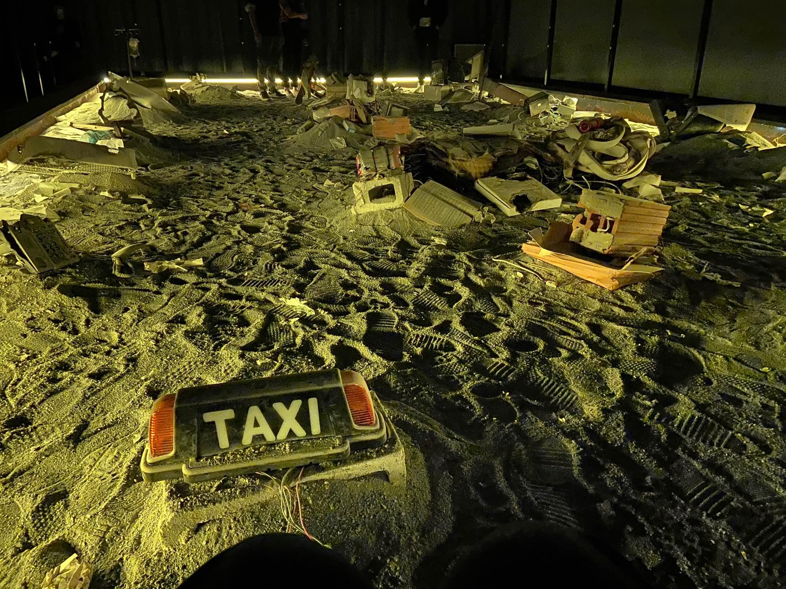
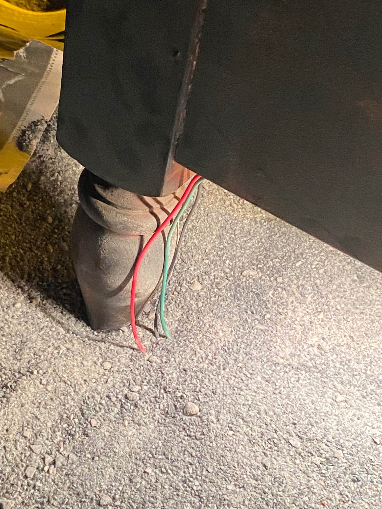
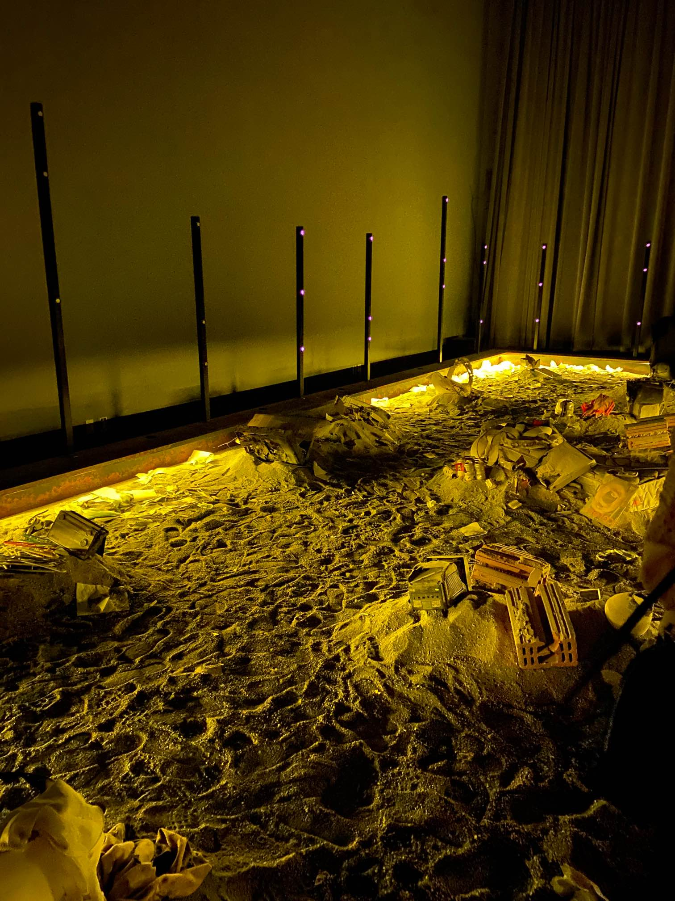
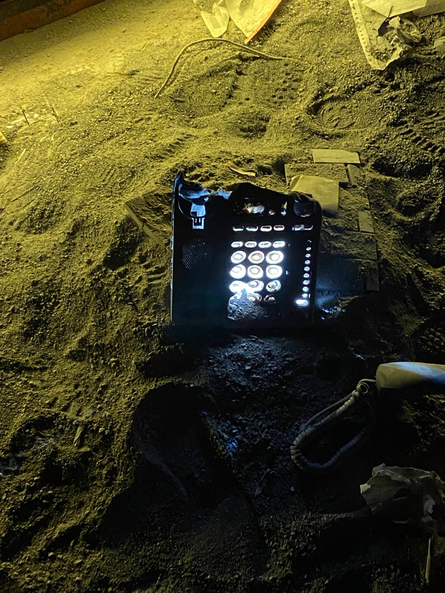
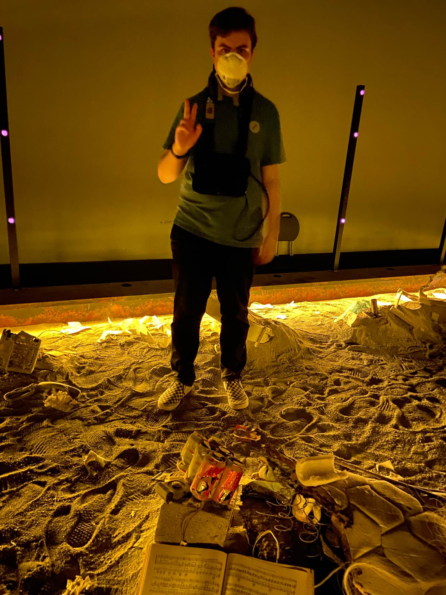
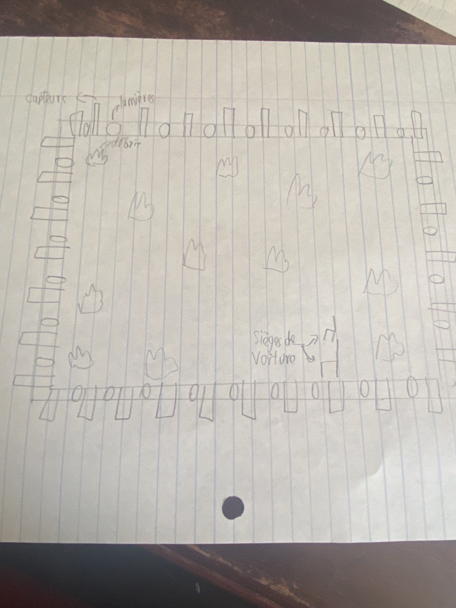

# Ciels à outrances

</img> 

### Réalisé par:

Brigitte Poupart et adapté d'un livre rédigé par Madeleine Monette en 2014. 

### Date de réalisation: 

Cette exposition a été créer en 2021-2022. Cette oeuvre était en développement depuis quatre ans et la production a commencé il y a deux ans. 

### Date de visite:

J'ai visité cet événement le 4 mars 2022 pendant la semaine de relâche.

### Lieu de l'exposition: 

Centre Phi dans le vieux-Montréal.

### Description de l'oeuvre:

Votre voyage vous mènera à travers une grande pièce obscure recouverte de cendres et de débris. Que s'est-il passé? Par où commencer?

Chaque poème met en scène des personnages en marge de la catastrophe. Vous serez amenés à les rencontrer sans disposer de leur portrait physique ou psychologique. Vous pourrez ainsi recréer un espace et un personnage sorti de votre imaginaire respectif grâce à votre interprétation de l’enveloppe sonore qui recompose les lieux où les personnages évoluent.

Basée sur la suite poétique Ciel à outrances de Madeleine Monette publiée aux Éditions de I'Hexagone.

###### Cet extrait vient du site web du Centre Phi dans l'événement Ciel à outrances.
https://phi.ca/fr/evenements/ciel-a-outrances/

### Mise en espace de l'oeuvre et éléments nécessaires:

Ciels à outrances requiert une pièce rectangulaire puisque l'oeuvre est dans un bac à sable rectangulaire. La pièce ne doit pas avoir de fenêtres car l'expérience doit être dans la noirceur. Ensuite, il faut placer plusieurs objets cassés dans le bac à sable comme des lampes, des fenêtres et un siège arrière d'une voiture. Et finalement, il faut installer les lumières qui entourent le bac à sable et d'autres dans les objets pour les illuminer. Finalement, il faut brancher les lumières pour qu'elles marchent.

### Liste des composantes techniques:

</img>  </img> 

</img> 

Cette oeuvre requiert: 

Des écouteurs branchés à un ipad pour entendre les poèmes.

Des lumières dans le bac à sable.

Des barres noires qui captent les personnes et leurs mouvements

Des lumières branchées dans les décombres et à l'entour du bac à sable.

### Expérience vécue:

</img> 

J'ai commencé l'oeuvre sur un siège arrière d'une voiture. J'entendais quelqu'un qui me racontait une histoire. Quand il avait arrêté, je devais me déplacer à un objet ou un débris qui produisait une lueur. En allant à cet objet lumineux, l'histoire se continuait. Les histoires de cette oeuvre sont basées sur les événements du 11 septembre 2001 quand les tours jumelles ont été frappés par des avions controllés par des terroristes. Une des histoires raconte le périple d'une femme enceinte qui commençait à accoucher pendant l'attaque.

J'ai aimé le fait que l'oeuvre nous démontre ce qui a pu arriver pendant cette attaque terroriste. Notre génération n'a jamais connu 9/11 donc cette oeuvre nous permet de comprendre ce qui s'est passé. Mais mon problème avec cette oeuvre, c'est qu'on m'a demandé à la fin d'écrire sur un papier ce que je me rapellait de 9/11. Puisque je suis né en 2004, je ne pouvais pas faire ca. Ce n'est pas un grand problème mais cet événement est disponible pour les personnes âgées de 11 ans et plus donc je ne pense pas que c'est nécessaire de faire cela. Mais je pense qu'elle devrait être une expérience personnelle car une vieille madame avait en quelque sorte ruinée mon expérience car elle utilisait sa flashlight pour voir le sol. Cela m'a irrité et m'a beaucoup dérangé. J'ai été déçu de l'employé qui s'occupait de mon groupe car il était ennuyant et avait un mauvais caractère. Et finalement, l'audio était parfois incompréhensible, je ne sais pas si c'était intentionné mais c'était décevant.

</img> 

Vidéo du site: https://www.youtube.com/watch?v=Cymz3hW6f24.

