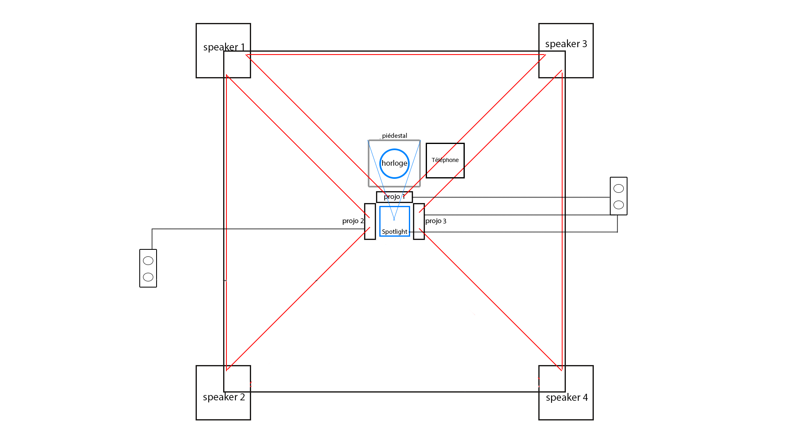

# Horloge de l'apocalypse

### Créé par:
- Maxime Sabourin
- Louis-Philippe Gravel
- Alexis Lacasse
- Tristan Girard-Montpetit
- Maxime De Falco

### Créé en 2022

### Horloge de l'apocalypse

### Lieu de l'événement:
Cégep Montmorency, studio TIM.

### Date de visite:
24 mars 2022

### Description de l'oeuvre:
L’horloge de l’apocalypse représente la ligne du temps de l’humanité. Selon le concept de l’horloge, il est présentement 11 h 58 et il reste 2 minutes avant la fin de l’humanité. À travers ce projet, l’interacteur est invité à contrôler l’horloge grâce aux aiguilles et ainsi manipuler la ligne du temps. Au cours de l’expérience, vous pourrez vivre les différentes époques auxquelles la terre a été exposée. Vous serez exposé aux différents enjeux actuels à travers la projection qui vous entourera et par le fait même vous plongera dans une immersion totale.

Référence: site des créations des finnissants. https://tim-montmorency.com/2022/projets/L-horloge-de-l-apocalypse/docs/web/index.html

### Mise en espace: 
Pour cette oeuvre, il faut installer des rideaux dans le petit studio où les images vont être projetées. Ensuite, il y a des speakers qu'il faut connecter à un ordinateur pour diffusé la traque sonore. Il faut aussi placer des spotlight sur le plafond. Il faut connecter les projecteurs à un ordi. Il faut ensuite placer la colonne au milieu de la salle pour ensuite placer l'horloge dessus. Finalement, il faut connecter le mécanisme attaché à l'horloge à une prise de courant et aussi placer le téléphone.

### Composantes techniques:
- Ordinateur
- Projecteur
- Mécanisme de l'horloge
- Téléphone
- Spotlight

### Mise en exposition:
- Rideaux

### Expérience vécue:
Pour cette oeuvre, je devais tourner l'aiguille de l'horloge pour faire changer les images et avancer le temps pour voir des paysages d'ères différentes. Quand la fin du monde arrive à minuit, je devais prendre le téléphone et l'oeuvre avait finit. Je trouve que cette oeuvre est très intéressante car les images de fond étaient belles et uniques et les animations étaient bien faits. J'ai beaucoup aimé la traque sonore car certaines musiques m'étaient familiers. J'aime beaucoup le thème que cette équipe a choisi et je n'ai aucun problème avec cette oeuvre.

