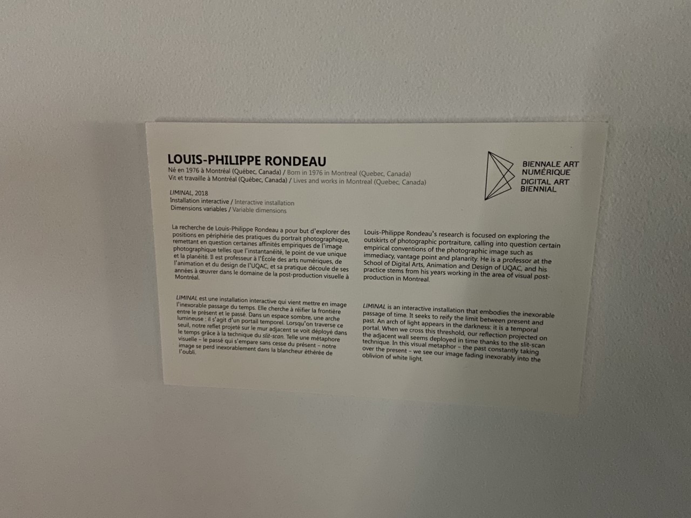

# LIMINAL

*Créée par Louis-Philippe Rondeau*

### Créée en 2018

### Exposition: METAMORPHOSIS

### Lieu de mise en exposition: Arsenal Contemporary Art

### Date de visite:  
- Jeudi 10 février 2022

### Description de l'oeuvre ou du dispositif multimédia: 

- Selon le site patenteux.com: 
L'anneau est fait d'aluminium en U de 2 cm de côté, recouvert d'acrylique blanc sur le côté ouvert. Il peut tenir debout sous son propre poids, mais doit être équilibré par de fins câbles métalliques fixés au plafond. Il est également possible de le fixer aux murs voisins. Dans le cas où la fixation au plafond ou au mur est irréalisable, on peut envisager, en dernier recours, d'utiliser des caissons de cinéma avec des sacs de sable. L'anneau est conçu pour être portable et facile à assembler.

</img> 

- Selon le cartel de l'oeuvre:
LIMINAL est une installation interactive qui vient mettre en image l'inexorable passage du temps. Elle cherche à réifier la frontière entre le présent et le passé. Dans un espace sombre , une arche lumineuse; il s'agit d'un portail temporel. Lorsqu'on traverse ce seuil, notre reflet projeté sur le mur adjacent se voit déployé dans le temps grâce à la technique du slit-scan. telle une métaphore visuelle - le passé qui s'empare sans cesse du présent - notre image se perd inexorablement dans la blancheur éthérée de l'oubli. 

### Explications sur la mise en espace de l'oeuvre ou du dispositif:
Premièrement, il faut trouver un endroit sombre où la lumière du jour ne peut atteindre l'oeuvre car la projection pourrait être affectée par la lumière. La lumière peut rendre la vue sur l'oeuvre très difficile. Ensuite, il faut un mur blanc où il est possible de projeter les images. Il faut ensuite installer l'anneau, l'allumer en branchant les fils et installer la caméra qui capte les mouvements. Après, il faut brancher l'ordinateur pour faire marcher le logiciel.

### Liste des composantes et techniques de l'oeuvre ou du dispositif :
Selon le site patenteux.com, cet oeuvre a besoin de:
- Un anneau en aluminum illuminé composé de 5 arcs de 165 cm de long.
- Une caméra usb de bonne qualité appliquée sur un côté de l'anneau.
- Un ordinateur Windows exécutant Derivative TouchDesigner.
- De nombreux câbles et adapteurs pour la caméra et l'anneau.
- Un projecteur HD ou de meilleur qualitée.
- Une paire de haut-parleurs activement amplifiés.
- Un subwoofer.
- Un plinthe.
- Du cablâge audio.
- Un câble HDMI.

### Liste des éléments nécessaires pour la mise en exposition:
- Il faudrait avoir un lieu sombre pour que la lumière n'affecte pas l'oeuvre, des câbles de soutien et un mur blanc pour projeter l'image. 

### Expérience vécue:
- Quand j'étais à l'exposition Arsenal, Liminal m'avait intéressé. J'ai commencé par mettre ma main devant la caméra et de la bouger pour faire des formes spéciales sur le mur et ensuite, j'ai passé devant la caméra pour voir ce que cela faisait. J'ai interagit plusieurs fois pour voir quel genre d'images je pourrais faire.
- J'ai bien aimé le fait que l'on pouvait faire plusieurs types d'images et certaines de ces images étaient plutôt drôles. Je pense que la technologie utilisé pour capter nos mouvements est très intéressante.
- La seule chose que j'aurais fais autrement pour cette oeuvre serait qu'elle capte aussi les couleurs, mais je ne sais pas si c'est possible. Je pense que cela serait vraiment intéressant car les images seraient plus attirantes et plaisantes à regarder.
